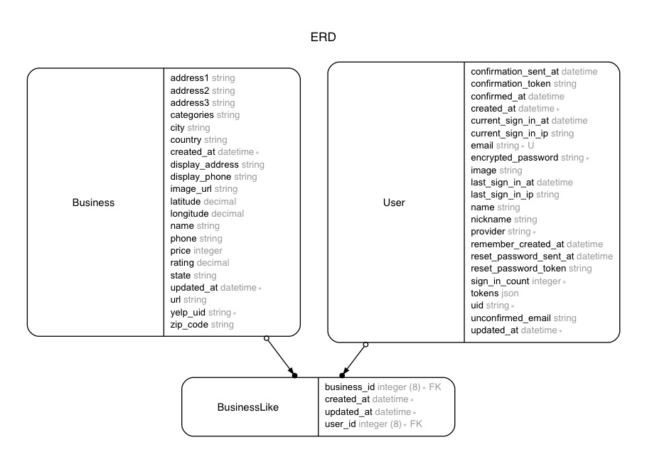

# MASA YELP

- A Yelp API server powered by [Yelp Business APIs (v3)](https://www.yelp.com/developers/documentation/v3).
- Authenticated users can save businesses they like.

## Available APIs
- [Yelp Business APIs (v3)](https://www.yelp.com/developers/documentation/v3).
- Masa-yelp API

## Yelp usage

#### [Yelp Search API](https://www.yelp.com/developers/documentation/v3/business_search)
- `/yelp`
- required params: location or a set of latitude and longitude
- optional params: see [docs](https://www.yelp.com/developers/documentation/v3/business_search)
- examples:
  + https://masa-yelp.herokuapp.com/yelp?location=washingtondc
  + https://masa-yelp.herokuapp.com/yelp?latitude=38.8977&longitude=-77.0365
  + https://masa-yelp.herokuapp.com/yelp?location=washingtondc&term=sushi

#### [Yelp Business API](https://www.yelp.com/developers/documentation/v3/business)
- `/yelp/:id`
- required params: id
- examples:
  + https://masa-yelp.herokuapp.com/yelp/bul-washington

#### [Yelp Reviews API](https://www.yelp.com/developers/documentation/v3/business_reviews)
- `/yelp/:id/reviews`
- required params: id
- examples:
  + https://masa-yelp.herokuapp.com/yelp/bul-washington/reviews

## Masa-yelp API usage
- Custom yelp API endpoints with custom search-filters.
- Authenticated users can save businesses they like.
- Original data is from Yelp APIs.
- examples:
  + https://masa-yelp.herokuapp.com/v1/businesses
  + https://masa-yelp.herokuapp.com/v1/businesses/bul-washington
  + https://masa-yelp.herokuapp.com/v1/businesses/bul-washington/reviews
  + https://masa-yelp.herokuapp.com/v1/businesses?q[rating_gt]=3
  + https://masa-yelp.herokuapp.com/v1/businesses?q[price_lt]=3
  + https://masa-yelp.herokuapp.com/v1/businesses?q[categories_cont]=bbq
  + https://masa-yelp.herokuapp.com/v1/businesses?location=white-house
  + https://masa-yelp.herokuapp.com/v1/businesses?latitude=38.8977&longitude=-77.0365
  + https://masa-yelp.herokuapp.com/v1/businesses?within=30&location=white-house
  + https://masa-yelp.herokuapp.com/v1/businesses?within=30&latitude=38.8977&longitude=-77.0365
  + https://masa-yelp.herokuapp.com/v1/businesses?per_page=3

## Response JSON format
- Keys are camel-cased as opposed to the original being snake-cased.
